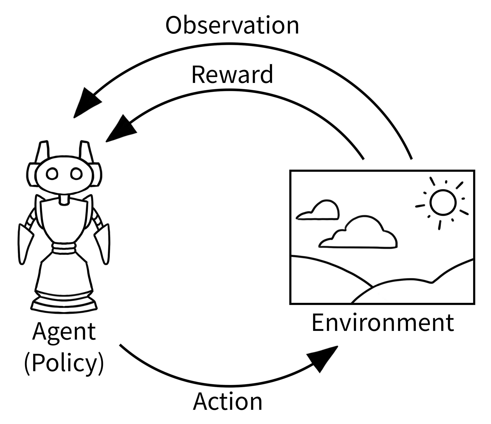
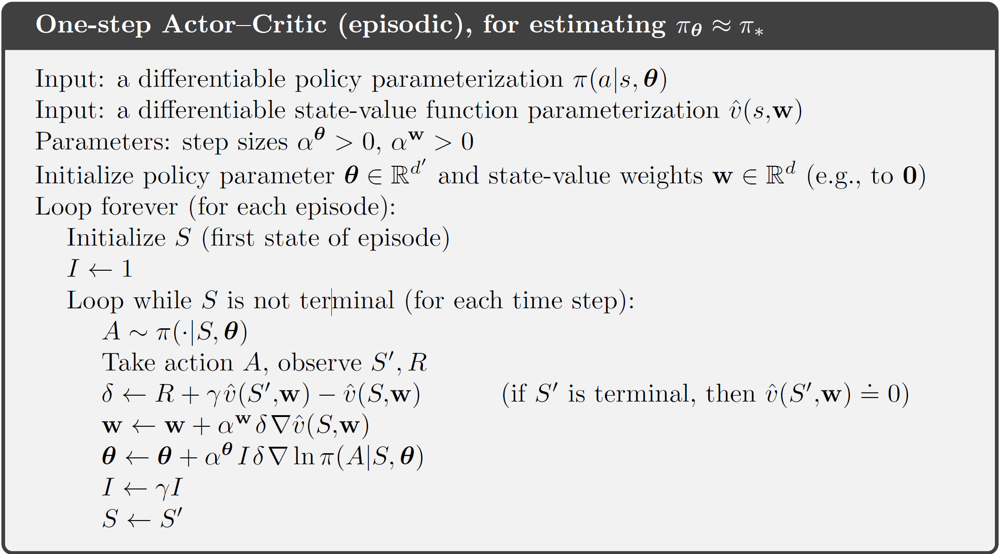
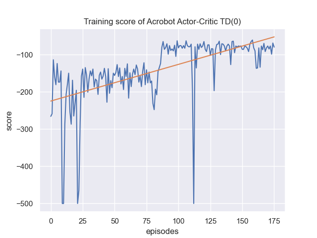

# Reinforcement Learning - University project

Author: Borislav Markov

## Intro
This project is for university class
on Reinforcement Learning, FMI, Sofia University.
It is a Actor-Critic python implementation for
learning the Acrobot[3] from the 
OpenGym environment.

## Environment Description [3]
The Acrobot environment consists 
of two links connected linearly to form a chain,
with one end of the chain fixed. 
The joint between the two links is actuated. 
The goal is to apply torques on the actuated 
joint to swing the free end of the linear chain 
above a given height while starting from the 
initial state of hanging downwards.

### Action Space [3]
The action is discrete, deterministic, and 
represents the torque applied on the actuated 
joint between the two links.
Actions:
 * 0: apply -1 [Nm] torque to the actuated joint
 * 1: apply 0 [Nm] torque to the actuated joint
 * 2: apply 1 [Nm] torque to the actuated joint

### Observation Space [3]
The observation is a ndarray with shape (6,) 
that provides information about the two rotational 
joint angles as well as their angular velocities:

<table class="docutils align-default">
<thead>
<tr class="row-odd"><th class="head">
Num
</th>
<th class="head">
Observation
</th>
<th class="head">
Min
</th>
<th class="head">
Max
</th>
</tr>
</thead>
<tbody>
<tr class="row-even"><td>
0
</td>
<td>
Cosine of <code class="docutils literal notranslate">theta1</code>
</td>
<td>
-1
</td>
<td>
1
</td>
</tr>
<tr class="row-odd"><td>
1
</td>
<td>
Sine of <code class="docutils literal notranslate">theta1</code>
</td>
<td>
-1
</td>
<td>
1
</td>
</tr>
<tr class="row-even"><td>
2
</td>
<td>
Cosine of <code class="docutils literal notranslate">theta2</code>
</td>
<td>
-1
</td>
<td>
1
</td>
</tr>
<tr class="row-odd"><td>
3
</td>
<td>
Sine of <code class="docutils literal notranslate">theta2</code>
</td>
<td>
-1
</td>
<td>
1
</td>
</tr>
<tr class="row-even"><td>
4
</td>
<td>
Angular velocity of <code class="docutils literal notranslate">theta1</code>
</td>
<td>
~ -12.567 (-4 * pi)
</td>
<td>
~ 12.567 (4 * pi)
</td>
</tr>
<tr class="row-odd"><td>
5
</td>
<td>
Angular velocity of <code class="docutils literal notranslate">theta2</code>
</td>
<td>
~ -28.274 (-9 * pi)
</td>
<td>
~ 28.274 (9 * pi)
</td>
</tr>
</tbody>
</table>

where

* `theta1` is the angle of the first joint, where an angle of 0 indicates the first link is pointing directly downwards.

* `theta2` is relative to the angle of the first link. An angle of 0 corresponds to having the same angle between the two links.

The angular velocities of theta1 and theta2 are bounded at ±4π, and ±9π rad/s respectively. A state of [1, 0, 1, 0, ..., ...] indicates that both links are pointing downwards.

### Rewards
The goal is to have the free end reach a designated 
target height in as few steps as possible, and as 
such all steps that do not reach the goal incur a 
reward of `-1`. Achieving the target height results 
in termination with a reward of 0. The reward
threshold is `-100`.

## Algorithm
The algorithm is mainly [1] but is adapted to the Pytorch
and uses Pytorch derivatives instruments.

Algorithm described in [1] is given on the following picture.

Actor is implemented as Neural Network.
Critic is implemented as Neural Network.

## Learning

Start `plot_scores-acrobot.py` to learn the process.
On this diagram it is visible how scores improve per episode 
during the online learning. The learning cannot reach much above
the target score of `-100`, which is normal. The threshold of
`-100` means we win and the networks are learned well enough.

Start `eval-actor-critic-acrobot.py` to see the trained
model in action. It only uses `outputs/acrobot-policy-model.bin`
for the policy without the random element in the policy. During 
the evaluation I removed the exploration element.

## Sources
 * [1] Reinforcement Learning: An Introduction, 2018, Richard S. Sutton and Andrew G. Barto,
   [PDF] http://www.incompleteideas.net/book/the-book-2nd.html
 * [2] Actor-Critic: Implementing Actor-Critic Methods, Cheng Xi Tsou, https://medium.com/geekculture/actor-critic-implementing-actor-critic-methods-82efb998c273
 * [3] Acrobot, OpenGym, https://www.gymlibrary.ml/environments/classic_control/acrobot/
 * [4] Pytorch documentation, https://pytorch.org/docs/stable/torch.html
 * [5] Probability distributions - torch.distributions, https://pytorch.org/docs/stable/distributions.html